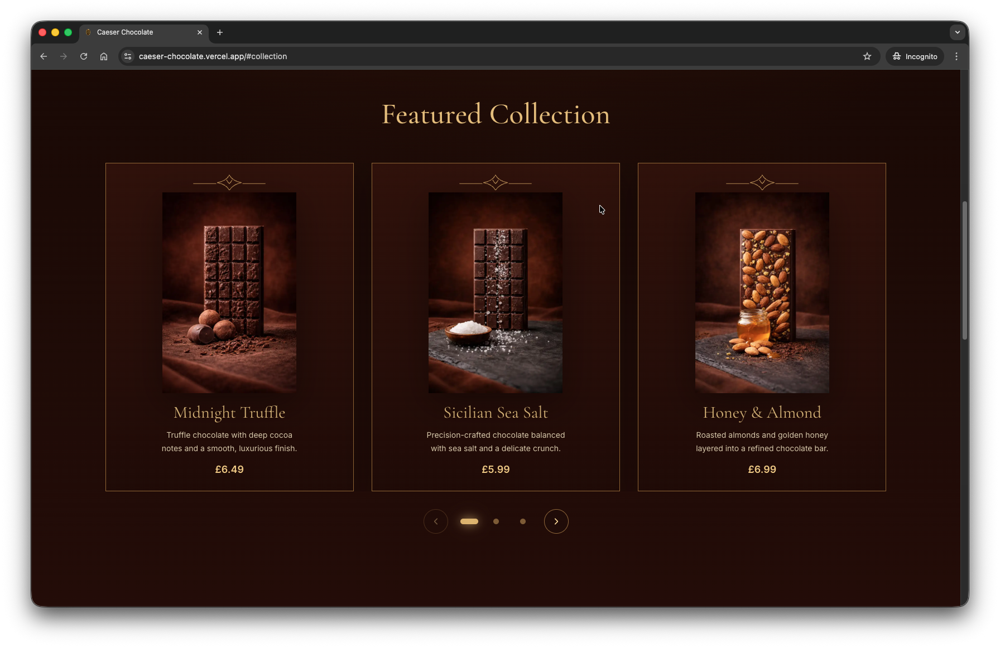
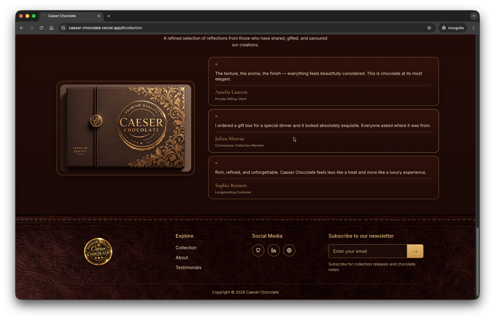
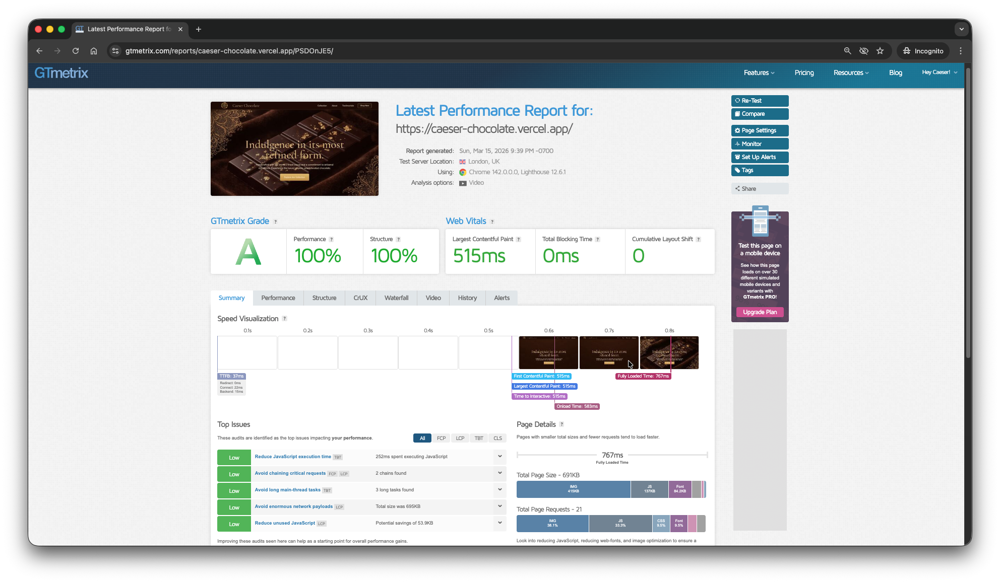
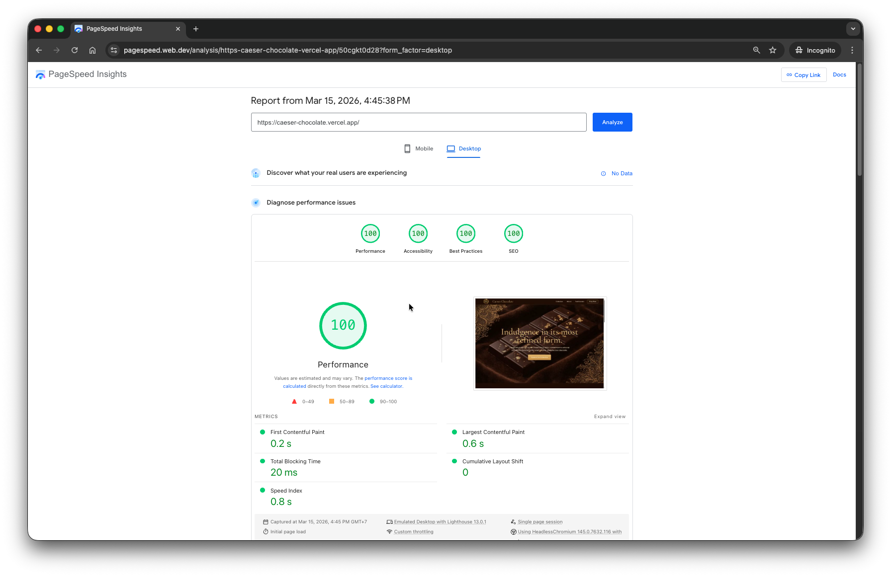
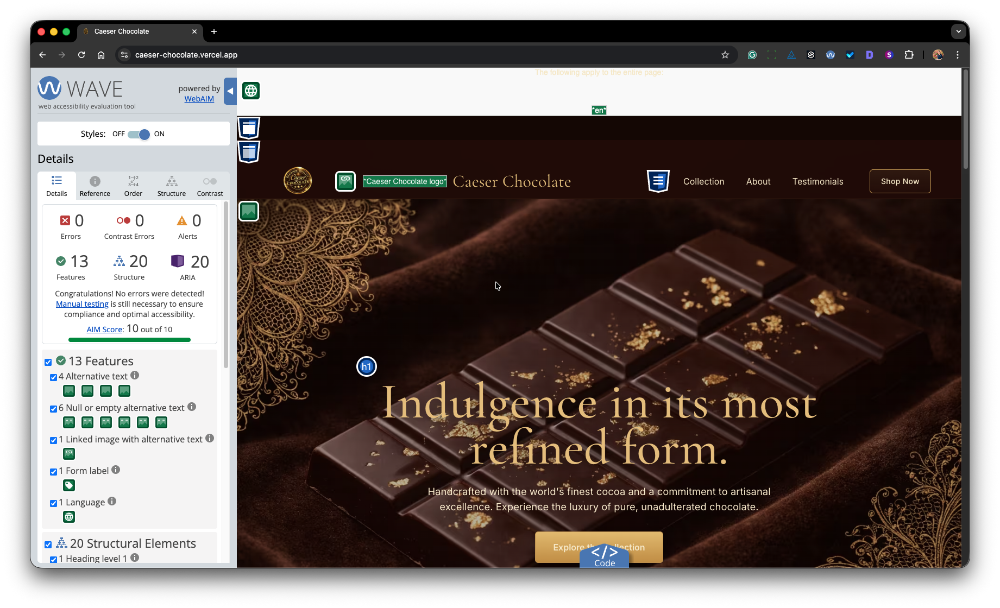
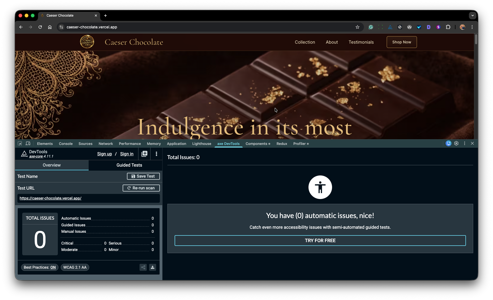

# 🍫 Caeser Chocolate

  
  

A modern chocolate brand landing page built with **Next.js 16**, **React 19**, **TypeScript**, and **Tailwind CSS 4**.

**Caeser Chocolate** was created as a portfolio project to demonstrate my **design eye**, **front-end engineering skills**, and ability to build polished, high-performance user experiences with modern web technologies. The project focuses on elegant visual presentation, clean layout structure, responsive design, and a smooth user experience from top to bottom.

This project also achieved a **full Lighthouse score**, with **100% green results across Performance, Accessibility, Best Practices, and SEO** — including excellent **Web Vitals**.

## Live Demo

**Live Demo:** [caeser-chocolate.vercel.app](https://caeser-chocolate.vercel.app/)

## Web Vitals

  
  

  
  

The site achieved **full scores across major testing categories**, including **Performance, Accessibility, Best Practices, SEO, and excellent Web Vitals**, showing that the project was built not only to look refined and high-end, but also to perform at an exceptional standard.

## About the Project

Caeser Chocolate is a premium-style promotional website designed to showcase a luxury chocolate brand. The goal was to create something visually rich and memorable, while still keeping the codebase clean, maintainable, and performant.

The site was built to highlight:

- strong visual hierarchy
- clean responsive layouts
- modern UI composition
- reusable component structure
- performance-focused front-end development
- attention to accessibility and SEO
- high Lighthouse and Web Vitals scores

## What It Demonstrates

This project was built to showcase my ability to:

- design and build a refined modern landing page from scratch
- translate a visual concept into a fast, responsive production-ready UI
- use **Next.js** and **React** effectively for modern front-end development
- structure components cleanly for maintainability
- optimise for **Lighthouse**, **Core Web Vitals**, and overall user experience
- balance design aesthetics with performance and accessibility

## Features

- **Modern landing page design**
- **Responsive layout** across desktop, tablet, and mobile
- **Luxury brand presentation** with strong visual styling
- **Fast performance** and optimised rendering
- **Accessible structure** with semantic markup
- **SEO-friendly foundation**
- **Reusable UI patterns** built with clean component composition

## Lighthouse

This project achieved:

- **Performance:** 100
- **Accessibility:** 100
- **Best Practices:** 100
- **SEO:** 100

Everything is fully green in Lighthouse, with excellent Web Vitals performance.

## Tech Stack

| Layer     | Technology           |
| --------- | -------------------- |
| Framework | Next.js 16           |
| Library   | React 19             |
| Language  | TypeScript           |
| Styling   | Tailwind CSS 4       |
| Utilities | clsx, tailwind-merge |
| Icons     | lucide-react         |

## Design Notes

The visual direction for Caeser Chocolate was inspired by premium product branding — rich imagery, clean typography, strong contrast, and elegant spacing. The aim was to make the site feel refined and high-end while keeping the experience lightweight and fast.

Every section was built with performance and presentation in mind, so the final result feels polished without sacrificing speed.

## Why I Built It

I built Caeser Chocolate as a focused front-end project to demonstrate both my **creative design sense** and my **engineering ability**. It reflects the kind of product-focused UI work I enjoy most: clean, modern, visually engaging interfaces backed by solid implementation.

## Author

**Caeser Ibrahim**  
Web Developer / Front-End Engineer

## License

This project is licensed under the MIT License.
